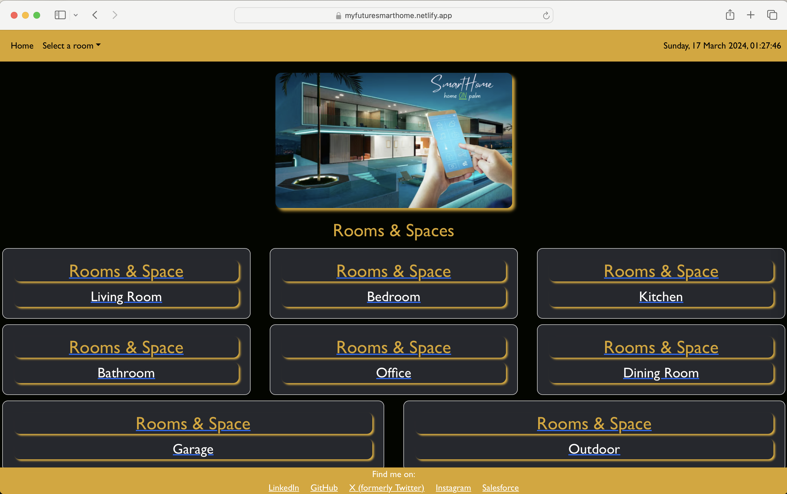

# SmartHome

Project 2 and final is to build an App that addresses a real-world scenario that helps ‘people with health conditions or impairments’ to manage their lights control within their rooms / homes to give them more independence and control of their surrounding environment.

The app is based on ‘Smart Home’ technology that could be in the future developed further to cover all other aspects of heating control, media control, security CCTV, alarms, garage gates etc. The app would be , in future, integrated with a system called KNX ( open standard for homes & buildings automation).

## Skills used / learned :

- React
- Node.js
- Deployment using Netlify

### Deployed URL : https://myfuturesmarthome.netlify.app/

- Deployed URL:
- 

### Wireframe tool used:

• draw.io

### Future development :

- Add functionality to allow the user to register their app, login using user name & password
- Add other functionalities to control heating control, media control, security CCTV, alarms, garage gates
- Add functionality to turn 'On' / 'Off' certain scenarios with just one button such as ' Cinema Scene', 'Out for shopping' etc
- Fixes of all bugs found during intial testing phase
- Integrate the app with EIBPORT technolgy to make use of the KNX technology
- Keep improving each functionality as per user's demands & needs

### CREDIT:

Please Note: I have learned so much during implementing this challenge given my early stages of developments with the huge aid of the following contributors:

ChatGPT: https://chat.openai.com/

- How to create apps with REACT & Nodes applications?
- How to create toggeled buttons between different rooms?
- How to set a lamp icon next to each room functionality to help users knows if light is 'On' or 'Off'
- Massive help with CSS styling to get the desired feel & look of the App
- Massive help with Troubleshooting errors that appeard in the console log and on the screen and suggestions of code corrections.
- Classes recordings
- React & Node.js classes / after hour classes recordings
- Functions and variables creations
- Full credit to students on the Discord group of helping each other’s out with couple of issues W3School

### Resources:

• W3School • ChatGPT • Google search engines • Classes recordings, activities and notes

### Installation:

• To access the webpage, the following URL should be used: “https://myfuturesmarthome.netlify.app/ ”.    
• Once accessed, Feel free to navigate through rooms & spaces by clicking any of the rooms cards on the hoe page or by selecting a room from the dropdown menu on the Naviogation bar.  
• As a developer who wishes to access the back-end files for this page, you will need to access GitHub to be able to open the repo via the following link: "https://github.com/WFlorida2/SmartHome/tree/main "  

• To run the app:

- Clone the Repository [ git clone https://github.com/username/repository.git]
- Navigate to the Project Directory [cd repository]
- Install Dependencies [npm install] or [yarn install]
- Run the Application [npm start] or [yarn start]
- Access the Application

#### End results:

